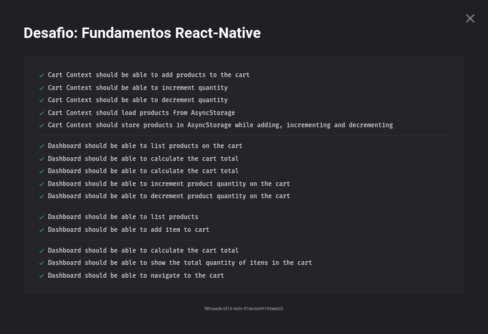

<h2 align="center">
  Desafio 08: GoMarketplace
</h2>

<blockquote align="center">“Não existe linha de chegada, a vitória está em se manter correndo”!</blockquote>

## Sobre o desafio 💪
Nesse desafio construímos o GoMarketplace, um aplicativo para android e ios feito em React Native, usmos uma api fake para trazer os dados.  
Deu para aprender bastante do AsyncStorage e do APIContext  
## Imagens do app 👀
</img>
</img>  
Para mais detalhes sobre o desafio e que era precisa ser feito para ser passado em cada teste, você pode ver neste <a href="https://github.com/rocketseat-education/bootcamp-gostack-desafios/tree/master/desafio-fundamentos-react-native">link</a>.

## 15/15 Testes Concluídos 🎯
Foi usado o Jest (uma estrutura de testes criada pelo Facebook) para realizar os testes e ver se passamos no desafio, os testes eram os seguintes 🛠  
</img>
